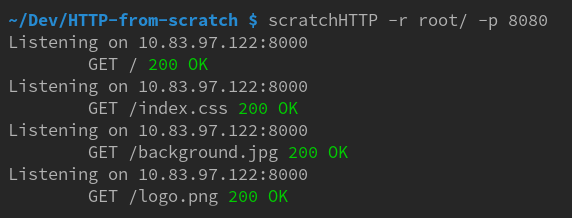

#+TITLE:Building an HTTP server from scratch
#+AUTHOR:Leonardo Bizzoni
#+DATE:Wed Aug  3 18:28:31 2022

* Table of Contents :TOC:
- [[#install][Install]]
- [[#how-to-use][How to use]]
- [[#cli-arguments][CLI arguments]]

* Install
Open a terminal window and run the following commands.
#+BEGIN_SRC bash
  git clone https://github.com/LeonardoBizzoni-Hobby/HTTP-from-scratch
  cd HTTP-from-scratch
#+END_SRC

You may also want to add the [[./][HTTP-from-scratch/]] directory to your PATH variable.

* How to use
By default simply running scratchHTTP will try to open a connection using your machine IPv4 address on port 8000 and will look for files to serve under the [[./root/][HTTP-from-scratch/root/]] directory.
#+BEGIN_SRC bash
  scratchHTTP
#+END_SRC

Placing all your files inside this directory it's *NOT recommended*.
You should instead create a separate folder to store your project and pass that path to scrathHTTP as a CLI argument with the `-r` flag.
#+BEGIN_SRC bash
  scratchHTTP -r path/to/project/dir/
#+END_SRC

* CLI arguments
- *-p*: specify a different port number (default is 8000)
- *-r*: specify a different root directory
- *-i*: change which document needs to be sent back when '/' is requested
- *-o*: write a verbose log to a file
- *-v*: show verbose logging
  
